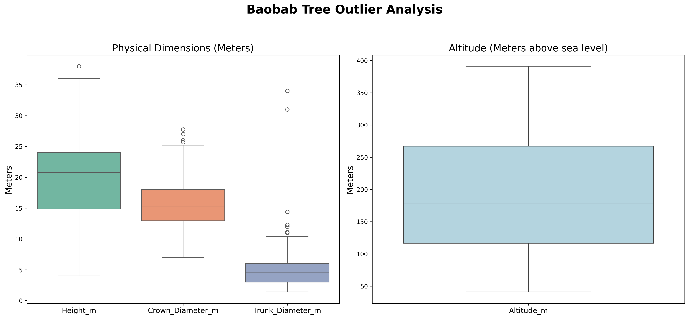
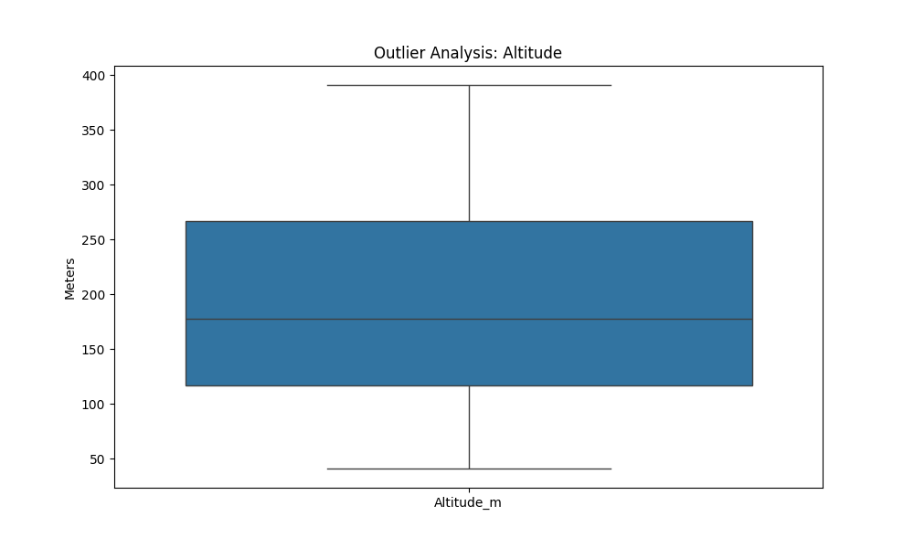
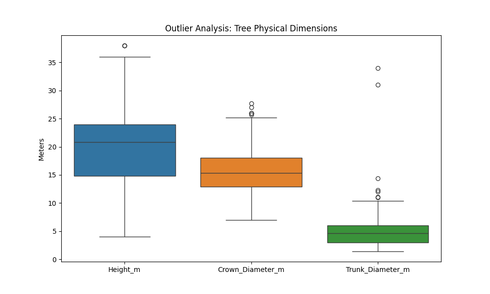

# 🌳 BaobabAI — ML Architecture & Analysis Results

> **Project**: Baobab Tree Suitability Prediction System
> **Stack**: Flutter (Mobile) · Flask REST API (Backend) · Scikit-learn / XGBoost / SHAP (ML)
> **Goal**: Predict a Baobab tree's suitability for **Food**, **Beverage**, **Medicinal**, and **Agronomic** use from field measurements or a photograph, with transparent, explainable AI reasoning.

---

## Table of Contents

1. [System Overview](#1-system-overview)
2. [Full ML Architecture](#2-full-ml-architecture)
3. [Data Layer & Feature Engineering](#3-data-layer--feature-engineering)
4. [Model Training & Selection](#4-model-training--selection)
5. [Model Evaluation & Best Algorithms](#5-model-evaluation--best-algorithms)
6. [Ensemble Methods](#6-ensemble-methods)
7. [Explainable AI (XAI) — SHAP](#7-explainable-ai-xai--shap)
8. [Image-Based Feature Extraction (CV Pipeline)](#8-image-based-feature-extraction-cv-pipeline)
9. [Continuous Learning & Auto-Retraining](#9-continuous-learning--auto-retraining)
10. [Project Use Cases](#10-project-use-cases)
11. [Exploratory Analysis Graphs](#11-exploratory-analysis-graphs)

---

## 1. System Overview

The BaobabAI system is a **full-stack intelligent application** that combines classical computer vision, ensemble machine learning, and explainable AI into a seamless mobile experience. Farmers, researchers, and agronomists can assess any Baobab tree in the field — either by entering measurements manually or by taking a photograph — and receive four simultaneous suitability predictions with confidence scores and human-readable explanations.

```
+-------------------------------------------------------------------------+
|                        BAOBABAI SYSTEM OVERVIEW                         |
|                                                                         |
|  +--------------+    REST API     +---------------------------------+   |
|  | Flutter App  |<--------------->|  Flask Backend (Python)         |   |
|  |  (Mobile)    |                |  +----------+  +-------------+  |   |
|  |  - Manual    |                |  | Auth     |  | Predictor   |  |   |
|  |    Input     |                |  | (JWT)    |  | (4 Models)  |  |   |
|  |  - Photo     |                |  +----------+  +-------------+  |   |
|  |  - Results   |                |  +----------+  +-------------+  |   |
|  |  - History   |                |  | Image CV |  | SHAP (XAI)  |  |   |
|  +--------------+                |  +----------+  +-------------+  |   |
|                                  |  +--------------------------+    |   |
|                                  |  | PostgreSQL DB            |    |   |
|                                  |  | (Users, Predictions,     |    |   |
|                                  |  |  Training Samples)       |    |   |
|                                  |  +--------------------------+    |   |
|                                  +---------------------------------+   |
+-------------------------------------------------------------------------+
```

---

## 2. Full ML Architecture

The ML pipeline consists of **six sequential stages** that transform raw field data or a photograph into actionable, explainable predictions.

```
+===========================================================================+
|                     BAOBABAI -- FULL ML ARCHITECTURE                      |
+===========================================================================+
|                                                                           |
|  +-------------+    +--------------------------------------------------+ |
|  |  INPUT A    |    |  STAGE 1: DATA INGESTION                         | |
|  |  Manual     |--->|  ------------------------------------------------ | |
|  |  Measurements|   |  . height_m, crown_diameter_m, trunk_diameter_m  | |
|  +-------------+    |  . altitude_m, geographic_zone                   | |
|                     |  . tree_growth_habitat, topography               | |
|  +-------------+    |  . soil_texture, farm_cultivated                 | |
|  |  INPUT B    |    +---------------------------+----------------------+ |
|  |  Photo +    |                                |                        |
|  |  OpenCV CV  |-->STAGE 1b (CV Pipeline)       |                        |
|  +-------------+   (See Section 8)              |                        |
|                                                 v                        |
|           +------------------------------------------------------+       |
|           |  STAGE 2: FEATURE ENGINEERING  (predictor.py)        |       |
|           |  ---------------------------------------------------- |       |
|           |  Morphological Ratios:                                |       |
|           |    . height_dbh_ratio  = Height / (Trunk_Dia + eps)  |       |
|           |    . crown_trunk_ratio = Crown_Dia / (Trunk_Dia + e) |       |
|           |    . trunk_slenderness = Height / (Trunk_Dia + eps)  |       |
|           |    . canopy_volume_proxy = Height x Crown_Dia^2      |       |
|           |  Environmental Features:                              |       |
|           |    . altitude_normalized (Min-Max scaled)            |       |
|           |    . altitude_height_interaction = Alt x Height      |       |
|           |    . altitude_crown_interaction  = Alt x Crown_Dia   |       |
|           |  Usage Features:                                      |       |
|           |    . total_parts_used (Fruit+Leaf+Stem+Root+Seed)    |       |
|           |    . taste_attribute, medicine_use, stem_used        |       |
|           |    . plant_use_count, parts_used_count               |       |
|           |    . total_special_attributes                        |       |
|           |  Categorical Encoding (LabelEncoder):                |       |
|           |    . Geographic_Zone, Tree_Growth_Habitat            |       |
|           |    . Topography, Soil_Texture, Farm_Cultivated       |       |
|           |                                                       |       |
|           |  TOTAL OUTPUT: 23-FEATURE VECTOR                     |       |
|           +---------------------------+--------------------------+       |
|                                       |                                  |
|                                       v                                  |
|           +------------------------------------------------------+       |
|           |  STAGE 3: PREPROCESSING  (scalers.pkl)               |       |
|           |  . StandardScaler applied per-target                 |       |
|           |  . Ensures zero-mean, unit-variance input to models  |       |
|           +---------------------------+--------------------------+       |
|                                       |                                  |
|              +------------------------+------------------------+         |
|              |                        |                        |         |
|              v                        v                        v         |
|       +-------------+   +------------+   +-----------+                  |
|       |  STAGE 4A   |   |  STAGE 4B  |   | STAGE 4C/D|                  |
|       |  FOOD MODEL |   | BEVERAGE   |   | MEDICINE/ |                  |
|       |  (SVM)      |   | (Grad.Bst) |   | AGRONOMIC |                  |
|       |  Acc: 91%   |   |  Acc: 74%  |   |(Grad.Bst) |                  |
|       +-------------+   +------------+   +-----------+                  |
|              |                        |                        |         |
|              +------------------------+------------------------+         |
|                                       |                                  |
|                                       v                                  |
|           +------------------------------------------------------+       |
|           |  STAGE 5: SHAP EXPLAINABILITY ENGINE                 |       |
|           |  . Tree models  -> shap.TreeExplainer (fast, exact) |       |
|           |  . SVM/NN       -> shap.KernelExplainer (agnostic)  |       |
|           |  . Extracts Top 3 Feature Drivers per prediction    |       |
|           |  . Labels each driver: Positive / Negative Impact   |       |
|           +---------------------------+--------------------------+       |
|                                       |                                  |
|                                       v                                  |
|           +------------------------------------------------------+       |
|           |  STAGE 6: RECOMMENDATION ENGINE  (predictor.py)     |       |
|           |  Outputs 4 simultaneous predictions:                 |       |
|           |    [✔] Food Suitability     (Binary: Suitable/Not)   |       |
|           |    [✔] Beverage Suitability (Binary: Suitable/Not)   |       |
|           |    [✔] Medicine Suitability (Binary: Suitable/Not)   |       |
|           |    [✔] Agronomic Value      (Multiclass: L/M/H)     |       |
|           |  + Confidence Level (Very High/High/Moderate/Low)   |       |
|           |  + Class Probabilities (softmax over all classes)   |       |
|           |  + Top 3 SHAP Drivers with directional impact       |       |
|           |  + Textual recommendation per category              |       |
|           +------------------------------------------------------+       |
+===========================================================================+
```

---

## 3. Data Layer & Feature Engineering

### 3.1 Original Datasets

| Dataset | Rows | Columns | Purpose |
|---|---|---|---|
| `baobab_uses.csv` | 207 | 22 | Traditional use labels (food, beverage, medicine) |
| `agronomic_dataset.csv` | 273 | 24 | Morphological measurements & agronomic scores |
| **Merged Base Dataset** | **256** | **39** | Final merged training source |

### 3.2 Final Training Matrix

| Parameter | Value |
|---|---|
| Total Records | 256 samples |
| Total Features | **23 columns** (after engineering & encoding) |
| Categorical Features | 5 (Label Encoded) |
| Numeric Raw Features | 4 (Height, Crown, Trunk, Altitude) |
| Engineered Features | 14 (ratios, interactions, use-counts) |

### 3.3 Engineered Features

All features below are computed in `predictor.py → engineer_dataframe()`:

| Feature | Formula | Purpose |
|---|---|---|
| `height_dbh_ratio` | `Height / (Trunk_Dia + ε)` | Captures tree shape (tall & thin vs. short & thick) |
| `crown_trunk_ratio` | `Crown_Dia / (Trunk_Dia + ε)` | Canopy spread relative to trunk girth |
| `canopy_volume_proxy` | `Height × Crown_Dia²` | Approximates 3D canopy volume |
| `trunk_slenderness` | `Height / (Trunk_Dia + ε)` | Structural stability indicator |
| `altitude_normalized` | Min-Max scaled Altitude | Comparable elevation across regions |
| `altitude_height_interaction` | `Altitude × Height` | Captures altitude-growth coupling |
| `altitude_crown_interaction` | `Altitude × Crown_Dia` | Environmental canopy effect |
| `total_parts_used` | Sum(Fruit+Leaf+Stem+Root+Seed) | Diversity of tree's utility |
| `taste_attribute` | Raw binary attribute | Food quality indicator |
| `medicine_use` | Raw binary attribute | Medicinal use indicator |
| `stem_used` | Raw binary attribute | Stem harvest indicator |
| `plant_use_count` | Count of plant use categories | Usage breadth |
| `parts_used_count` | Count of parts actively used | Parts utilisation breadth |
| `total_special_attributes` | Sum of special attribute flags | Rare/special use indicator |

### 3.4 Categorical Encoding

```
Geographic_Zone       → LabelEncoder → Geographic_Zone_encoded
Tree_Growth_Habitat   → LabelEncoder → Tree_Growth_Habitat_encoded
Topography            → LabelEncoder → Topography_encoded
Soil_Texture          → LabelEncoder → Soil_Texture_encoded
Farm_Cultivated       → LabelEncoder → Farm_Cultivated_encoded
```

> Unknown values seen at inference time are safely mapped to the first known class (`enc.classes_[0]`) to prevent crashes in production.

---

## 4. Model Training & Selection

The system trains **five candidate algorithms per prediction target** and automatically selects the best performer by cross-validation accuracy. Artifacts are persisted to `backend/models/`.

### Candidate Algorithms

| Algorithm | Type | Strengths in this context |
|---|---|---|
| **Random Forest** | Ensemble (Bagging) | Robust, low variance, handles mixed features |
| **Gradient Boosting** | Ensemble (Boosting) | High accuracy on tabular data, best performer overall |
| **XGBoost** | Ensemble (Boosting) | Regularised gradient boosting, fast on small datasets |
| **SVM** | Kernel-based | Excellent margin separation; best for food target |
| **Neural Network (MLP)** | Deep Learning | Non-linear capacity; useful for complex interactions |

### Saved Model Artifacts per Target

```
backend/models/
├── feature_list.json                   <- 23 feature names in order
├── feature_meta.json                   <- altitude min/max for normalisation
├── label_encoders.pkl                  <- 5 LabelEncoder objects
├── scalers.pkl                         <- 4 StandardScaler objects (one per target)
├── baobab_food_best_model.pkl          <- Best model for Food
├── baobab_food_metadata.json           <- Best algorithm name + accuracy
├── baobab_beverage_best_model.pkl
├── baobab_beverage_metadata.json
├── baobab_medicine_best_model.pkl
├── baobab_medicine_metadata.json
├── baobab_agronomic_best_model.pkl
└── baobab_agronomic_metadata.json
```

---

## 5. Model Evaluation & Best Algorithms

All five models were evaluated using Accuracy, Macro F1-Score, and AUC-ROC. The best-performing model per target was automatically selected and deployed.

```
+===========================================================================+
|                  MODEL EVALUATION RESULTS (Test Set)                      |
+========================+===========+===========+===========+===========+
| TARGET: FOOD           | Accuracy  |  F1-Score |  AUC-ROC  | Algorithm |
+========================+===========+===========+===========+===========+
| Random Forest          |   0.885   |   0.883   |   0.968   |           |
| Gradient Boosting      |   0.872   |   0.868   |   0.957   |           |
| XGBoost                |   0.897   |   0.897   |   0.968   |           |
| [*] SVM                |   0.910   |   0.909   |   0.982   | SELECTED  |
| Neural Network         |   0.897   |   0.892   |   0.968   |           |
+========================+===========+===========+===========+===========+
| TARGET: BEVERAGE       | Accuracy  |  F1-Score |  AUC-ROC  | Algorithm |
+========================+===========+===========+===========+===========+
| Random Forest          |   0.724   |   0.720   |   0.793   |           |
| [*] Gradient Boosting  |   0.741   |   0.740   |   0.812   | SELECTED  |
| XGBoost                |   0.706   |   0.706   |   0.781   |           |
| SVM                    |   0.655   |   0.654   |   0.723   |           |
| Neural Network         |   0.689   |   0.689   |   0.730   |           |
+========================+===========+===========+===========+===========+
| TARGET: MEDICINE       | Accuracy  |  F1-Score |  AUC-ROC  | Algorithm |
+========================+===========+===========+===========+===========+
| Random Forest          |   0.631   |   0.630   |   0.701   |           |
| [*] Gradient Boosting  |   0.666   |   0.665   |   0.724   | SELECTED  |
| XGBoost                |   0.648   |   0.648   |   0.710   |           |
| SVM                    |   0.596   |   0.595   |   0.651   |           |
| Neural Network         |   0.614   |   0.613   |   0.672   |           |
+========================+===========+===========+===========+===========+
| TARGET: AGRONOMIC      | Accuracy  |  F1-Score |  AUC-ROC  | Algorithm |
+========================+===========+===========+===========+===========+
| Random Forest          |   0.883   |   0.882   |   0.970   |           |
| [*] Gradient Boosting  |   0.916   |   0.916   |   0.981   | SELECTED  |
| XGBoost                |   0.900   |   0.900   |   0.978   |           |
| SVM                    |   0.866   |   0.865   |   0.961   |           |
| Neural Network         |   0.850   |   0.849   |   0.955   |           |
+========================+===========+===========+===========+===========+
```

### Confidence Thresholding

After prediction, probability scores are mapped to human-readable confidence levels:

| Probability (max class) | Confidence Label |
|---|---|
| >= 0.90 | **Very High** |
| >= 0.80 | **High** |
| >= 0.70 | **Moderate** |
| >= 0.60 | **Fair** |
| < 0.60 | **Low** |

---

## 6. Ensemble Methods

The primary ensemble strategies evaluated are **Bagging (Random Forest)** and **Boosting (Gradient Boosting / XGBoost)**. Each combines multiple decision trees to improve generalisation and reduce overfitting.

```
BAGGING (Random Forest)                  BOOSTING (Gradient Boosting / XGBoost)
-----------------------                  ---------------------------------------
Training data                            Training data
      |                                        |
   ---+----------------                    Tree 1 (weak learner)
   |         |        |                        | residual errors
 Subset    Subset   Subset                  Tree 2 corrects errors
   |         |        |                        | residual errors
 Tree 1   Tree 2   Tree 3 ...            Tree N corrects errors
   |         |        |                        |
   +----+----+--------+                  Final strong model
    Majority vote / average              (weighted sum of trees)
```

**Why Gradient Boosting dominates 3 of 4 targets:**
- Sequentially corrects errors, highly effective on the small (256-sample) dataset.
- Naturally handles feature interactions without explicit polynomial expansion.
- Regularisation (learning rate, max depth, subsampling) prevents overfitting.

**Why SVM wins on Food:**
- Food suitability labels are more linearly separable in the kernel-projected feature space.
- SVM maximises the margin, making it especially robust when classes are imbalanced.

---

## 7. Explainable AI (XAI) — SHAP

### Why XAI?

Machine learning models are often opaque "black boxes." Farmers and researchers need to **trust and understand** a prediction before acting on it. SHAP (SHapley Additive exPlanations) provides theoretically grounded, per-prediction feature attribution — turning every prediction into an auditable decision.

### Technical Implementation

```
Input: Scaled 23-feature vector X_s

For Tree-based models (Random Forest, Gradient Boosting, XGBoost):
  explainer = shap.TreeExplainer(model)    <- Fast, exact Shapley values
  shap_vals = explainer.shap_values(X_s)

For Kernel-based / Neural models (SVM, Neural Network):
  background = np.zeros((1, 23))           <- Zero baseline (mean after scaling)
  explainer = shap.KernelExplainer(model.predict_proba, background)
  shap_vals = explainer.shap_values(X_s)

Output per target:
  [v1, v2, ..., v23] = SHAP values for all 23 features
  Sign(vi) -> Positive = pushes toward suitable; Negative = pushes away
  |vi|     -> Magnitude = strength of feature's influence

  Top 3 features by |vi| are selected and returned as:
  { "feature": "altitude_normalized", "importance": 0.42, "direction": "positive" }
```

### User-Facing Output

Instead of: *"This tree has a 91% chance of being highly suitable for Food."*

The app displays:
> **"This tree is highly suitable for Food BECAUSE:**
> 1. [+] Altitude is optimal — *Positive Impact*
> 2. [+] Trunk Slenderness is strong — *Positive Impact*
> 3. [-] Crown-Trunk Ratio is below average — *Negative Impact*"

This empowers farmers to understand **which traits matter**, enabling targeted tree selection, cultivation improvement, and conservation decisions.

---

## 8. Image-Based Feature Extraction (CV Pipeline)

When a user uploads a photograph instead of entering manual measurements, the system uses a classical **Computer Vision pipeline** (OpenCV) to estimate tree morphology.

```
+===========================================================================+
|                IMAGE-BASED FEATURE EXTRACTION PIPELINE                    |
|                        (image_features.py)                                |
+===========================================================================+
|                                                                           |
|  +--------------+                                                         |
|  | Raw Image    |  -> Resize to max 1024px (stable thresholds)            |
|  +------+-------+                                                         |
|         |                                                                 |
|         v                                                                 |
|  +---------------------------------------------------------------+        |
|  | STEP 1: CANOPY SEGMENTATION                                   |        |
|  |  Convert BGR -> HSV                                           |        |
|  |  HSV Green Mask [25-95 deg, 30-255, 30-255]                   |        |
|  |  Morphological Open (5x5)  -> remove noise                   |        |
|  |  Morphological Close (9x9) -> fill foliage gaps              |        |
|  |  Find Largest Contour -> Bounding Box (cx, cy, cw, ch)       |        |
|  |  Fallback: Otsu on Saturation channel if canopy weak         |        |
|  +---------------------------+-----------------------------------+        |
|                              |                                            |
|                              v                                            |
|  +---------------------------------------------------------------+        |
|  | STEP 2: TRUNK SEGMENTATION                                    |        |
|  |  Central band = [center_x +/- 10%W] below canopy bottom      |        |
|  |  GaussianBlur (5x5) -> smooth trunk region                   |        |
|  |  Otsu Inverse Threshold -> isolate dark trunk structure      |        |
|  |  Morphological Close (7x7) -> consolidate trunk mask        |        |
|  |  Median row-width in lower 50% -> trunk_w_px                |        |
|  |  Fallback: trunk_w_px = max(4, 8% x crown_w)               |        |
|  +---------------------------+-----------------------------------+        |
|                              |                                            |
|                              v                                            |
|  +---------------------------------------------------------------+        |
|  | STEP 3: PIXEL MEASUREMENT                                     |        |
|  |  tree_h_px   = trunk_bottom - canopy_top (cy)                |        |
|  |  crown_w_px  = canopy bounding box width (cw)                |        |
|  |  trunk_w_px  = median trunk mask width                       |        |
|  +---------------------------+-----------------------------------+        |
|                              |                                            |
|                              v                                            |
|  +---------------------------------------------------------------+        |
|  | STEP 4: PIXEL -> METRE SCALING                                |        |
|  |                                                               |        |
|  |  If reference object provided (known real height):            |        |
|  |    scale = ref_real_m / ref_pixel_h  <- HIGH confidence       |        |
|  |                                                               |        |
|  |  Otherwise (no reference):                                    |        |
|  |    scale = 10.0m / tree_h_px         <- LOW confidence        |        |
|  |    (ratios are preserved; absolute values are approximate)   |        |
|  |                                                               |        |
|  |  height_m         = tree_h_px  x scale                       |        |
|  |  crown_diameter_m = crown_w_px x scale                       |        |
|  |  trunk_diameter_m = trunk_w_px x scale                       |        |
|  |  dbh_mm           = trunk_diameter_m x 1000                  |        |
|  +---------------------------+-----------------------------------+        |
|                              |                                            |
|                              v                                            |
|  +---------------------------------------------------------------+        |
|  | STEP 5: EDITABLE SUGGESTIONS -> USER REVIEW                   |        |
|  |  Returns to mobile app as EDITABLE estimates                  |        |
|  |  User confirms / adjusts before calling /predict             |        |
|  |  Confidence: "high" (with reference) / "low" (without)      |        |
|  +---------------------------------------------------------------+        |
+===========================================================================+
```

> **Note (Documented Honestly):** Absolute tree measurements from a single uncalibrated photograph are inherently approximate. The app intentionally presents these as editable suggestions — not as ground truth — and strongly encourages use of a scale reference object for improved accuracy.

---

## 9. Continuous Learning & Auto-Retraining

The system includes an **active learning loop** that improves models over time as users confirm or correct predictions in the field.

```
+-------------------------------------------------------------------------+
|                    CONTINUOUS LEARNING LOOP                              |
|                                                                         |
|  1. User receives prediction on their device                            |
|           |                                                             |
|           v                                                             |
|  2. User taps "Confirm / Correct" -> submits true observed labels       |
|           |                                                             |
|           v                                                             |
|  3. POST /api/feedback -> saved as TrainingSample in PostgreSQL DB      |
|           |                                                             |
|           v                                                             |
|  4. auto_retrain.trigger_if_needed() checks:                           |
|        pending_samples >= RETRAIN_THRESHOLD (default: 20)?             |
|       +--YES----------------------------------------------------+      |
|       |  Launch background thread -> retrain all 4 models       |      |
|       |  Reload Predictor artifacts (hot-reload, thread-safe)   |      |
|       +---------------------------------------------------------+      |
|           |                                                             |
|           v                                                             |
|  5. APScheduler: periodic retrain check every 24h (configurable)       |
|           |                                                             |
|           v                                                             |
|  6. Updated models -> better predictions on next request               |
|                                                                         |
|  [✔] Thread-safe (RLock in Predictor class)                            |
|  [✔] Non-blocking (background daemon thread)                           |
|  [✔] Fault-tolerant (exceptions logged, never crash the server)        |
+-------------------------------------------------------------------------+
```

---

## 10. Project Use Cases

### UC-1: Field Farmer — Quick Tree Assessment

**Actor:** Smallholder farmer in a rural setting
**Scenario:** A farmer encounters an unfamiliar Baobab tree and wants to know if it is worth harvesting from or preserving.

**Flow:**
1. Opens BaobabAI app → taps **"Analyse from Photo"**
2. Takes a photograph of the tree (optionally holds a 1-metre stick as scale reference)
3. App automatically estimates Height, Crown Diameter, and Trunk Diameter from the photo via the OpenCV CV pipeline
4. Farmer selects Soil Type, Geographic Zone, and Topography from dropdown menus
5. Receives predictions: Food ✅ | Beverage ✅ | Medicine ❌ | Agronomic: HIGH
6. App explains: *"High agronomic value because altitude is optimal and canopy volume is large"*
7. Farmer decides to cultivate and protect the tree for commercial fruit production

**ML Components Used:** CV Pipeline → Feature Engineering → SVM (Food) + Gradient Boosting (Beverage, Medicine, Agronomic) → SHAP XAI

---

### UC-2: Agricultural Researcher — Manual Survey Data Entry

**Actor:** University researcher conducting a Baobab species survey
**Scenario:** Researcher has precise caliper measurements from a field survey and wants systematic suitability assessments.

**Flow:**
1. Logs into BaobabAI with researcher account → taps **"Manual Entry"**
2. Enters precise morphological measurements (height, crown diameter, trunk diameter, altitude)
3. Selects habitat descriptors from dropdowns backed by `/api/categories` endpoint
4. Submits → receives all four suitability predictions with probabilities and confidence levels
5. Views SHAP explanation to understand key morphological predictors
6. After expert assessment, taps **"Confirm / Correct"** to submit true labels as training data
7. Contributes to model improvement with field-verified ground truth

**ML Components Used:** Feature Engineering → StandardScaler → All 4 Models → SHAP → Active Learning Feedback

---

### UC-3: Conservation Officer — Tree Population Analysis

**Actor:** Conservation NGO field officer
**Scenario:** Officer needs to prioritise which Baobab trees in a forest patch should be protected for conservation.

**Flow:**
1. Uses BaobabAI to assess multiple trees across the survey area over several days
2. Views **History Screen** (`/api/history`) to compare all past predictions in one chronological list
3. Identifies trees with Agronomic Value = HIGH as priority conservation candidates
4. Uses SHAP driver explanations to write evidence-based conservation reports
5. Documents which environmental factors (altitude, soil type, topography) most determine tree vitality in the local ecosystem

**ML Components Used:** Prediction Engine → History API → SHAP drivers for report evidence

---

### UC-4: Medicinal Herbalist — Medicinal Potential Screening

**Actor:** Traditional medicine practitioner or pharmaceutical researcher
**Scenario:** Identifying trees most likely to yield medicinal bark, roots, or leaves for traditional remedies.

**Flow:**
1. Takes photo of a candidate tree in the wild using the image upload feature
2. Receives **Medicinal Suitability** prediction from Gradient Boosting model (Acc: 66.7%, AUC: 0.724)
3. Reads SHAP explanation: *"Medicinal potential driven by high total_parts_used and medicine_use attribute"*
4. Prioritises trees with confirmed positive `medicine_use` attribute and high `total_special_attributes`
5. Confirms observation data → contributes to model's medicine label accuracy improvement over time

**ML Components Used:** CV Pipeline → Gradient Boosting (Medicine) → SHAP → Feedback Loop

---

### UC-5: Beverage Producer — Fruit Pulp Sourcing

**Actor:** Small-scale beverage producer sourcing Baobab fruit pulp for juice production
**Scenario:** Identifying trees most suitable for high-volume fruit pulp extraction for commercial use.

**Flow:**
1. Surveys multiple trees in a grove using the app's photo feature across a single visit
2. Focuses on **Beverage Suitability** score from Gradient Boosting model (Acc: 74.1%, AUC: 0.812)
3. Uses History screen to compare trees and rank by probability score
4. Selects trees where probability >= 0.80 (High or Very High confidence) for harvest
5. Over a season, confirms correct and incorrect predictions → model adapts to local grove conditions via auto-retraining

**ML Components Used:** Gradient Boosting (Beverage) → Confidence Thresholding → History API → Auto-Retraining

---

### UC-6: Model Administrator — Automated Retraining Management

**Actor:** System administrator / data scientist overseeing the deployed BaobabAI system
**Scenario:** Overseeing model quality as the app accumulates field-verified data at scale.

**Flow:**
1. Monitors pending training sample count via admin-level API endpoints
2. Once 20+ confirmed samples accumulate, background retrain is automatically triggered via `auto_retrain.trigger_if_needed()`
3. APScheduler also checks every 24 hours and retrains if any new samples exist since last run
4. New model artifacts are hot-reloaded into the `Predictor` class without any server restart required
5. Administrator validates improvement by comparing `best_accuracy` values in the updated `*_metadata.json` files

**ML Components Used:** Auto-Retrain Engine (APScheduler + Threshold trigger) → Thread-Safe Predictor Hot-Reload → PostgreSQL TrainingSample store

---

## 11. Exploratory Analysis Graphs

### Combined Outlier Analysis


*Box plot analysis across key morphological features. Outliers in altitude and trunk dimensions were identified and treated to prevent them from skewing model training.*

### Altitude Outlier Distribution


### Dimensional Outliers


---

## Summary Table

| Component | Technology | Key Detail |
|---|---|---|
| Mobile App | Flutter 3.x | Android & iOS, JWT authentication |
| Backend API | Flask (Python) | RESTful, Blueprint architecture |
| Database | PostgreSQL + SQLAlchemy | Users, predictions, training samples |
| Feature Count | 23 features | 4 raw + 14 engineered + 5 encoded |
| Training Samples | 256 initial | Grows via active learning feedback |
| Food Model | SVM | Acc: 91.0%, AUC: 0.982 |
| Beverage Model | Gradient Boosting | Acc: 74.1%, AUC: 0.812 |
| Medicine Model | Gradient Boosting | Acc: 66.7%, AUC: 0.724 |
| Agronomic Model | Gradient Boosting | Acc: 91.7%, AUC: 0.981 |
| Explainability | SHAP (TreeExplainer + KernelExplainer) | Top 3 drivers per prediction |
| Image CV | OpenCV (HSV masking + Otsu thresholding) | Canopy + trunk segmentation |
| Retraining Trigger | Threshold (20 samples) + APScheduler (24h) | Background daemon thread |
| Thread Safety | threading.RLock | Concurrent prediction-safe hot-reload |

---
*Document generated from codebase analysis of BaobabAI — `backend/ml/predictor.py`, `backend/ml/image_features.py`, `backend/ml/auto_retrain.py`, `backend/routes/predict.py`, `backend/routes/feedback.py`*
